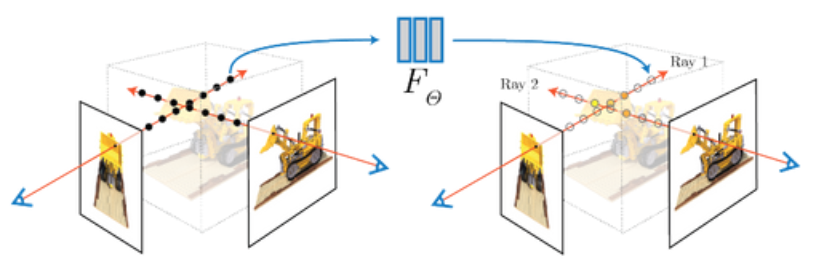

# NeRF - Neural Radiance Field 
Implementing the original method from [[1]](https://arxiv.org/abs/2003.08934). 
Neural Radiance Fields (NeRF) is a novel approach for synthesizing 3D scenes from 2D images. It represents scenes as continuous 5D functions that output color and density for any given 3D point in space and 2D viewing direction. This method allows for high-quality, photorealistic rendering of 3D scenes from novel viewpoints, not just those captured by the input images. NeRF achieves this by training a neural network with multiple 2D images of a scene taken from various viewpoints, learning the scene's structure and appearance. The network then predicts the color and opacity for any given point and viewing angle, enabling the creation of new images from perspectives not originally photographed. For a detailed explanation, please see [the project page](https://rbe549.github.io/fall2022/proj/p3/).



## How to Run
Train the network:

```
python train.py
```
Test the  network:

```
python test.py
```

## Results 


## Acknowledgement 

This project was part of RBE549-Computer Vision (Fall 22) at Worcester Polytechic Institute[[1]](https://rbe549.github.io/fall2022/proj/p3/).  
Team members :[Thabsheer Machingal](https://github.com/thabsheerjm) and [Krishna Madhurkar](https://github.com/Krishnamadhurkar)

## References 
[1] [NeRF: Representing Scenes as Neural Radiance Fields for View Synthesis](https://arxiv.org/abs/2003.08934)  
[2] [RBE549-Project3](https://rbe549.github.io/fall2022/proj/p3/)
