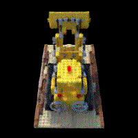

# NeRF - Neural Radiance Field 
Implementing the original method from [[1]](https://arxiv.org/abs/2003.08934). 

## How to Run
Train the network:

```
train.py
```
Test the  networ:

```
test.py
```

## Results 



## References 
[1] [NeRF: Representing Scenes as Neural Radiance Fields for View Synthesis](https://arxiv.org/abs/2003.08934)  
[2] [RBE549-Project3](https://rbe549.github.io/fall2022/proj/p3/)
